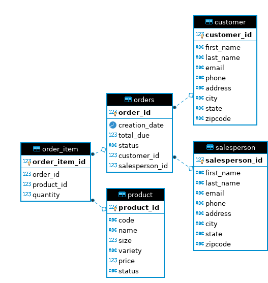

# JDBC

## Introduction
This JDBC-based application allows users to perform basic CRUD (Create, Read, Update, Delete) operations on a PostgreSQL database using DAO (Data Access Object) pattern. Building this application helped me to learn the basics of using JDBC which is a versatile Java API for accessing any RDBMS. I also learnt to handle SQL exceptions as well as using commits and rollbacks in JDBC.

## ER Diagram
Following is the ER diagram of the database of this application:

## Design Patterns
There are two common design patterns for JDBC in order to create an abstraction layer between the raw JDBC code and the rest of the application code:
1. DAO Pattern : In the Data Access Object pattern, one DAO object can be used to access one or more tables.
2. Repository Pattern: In the repository pattern, one DAO object can be used to access only one table.

When to use which pattern:

**Condition** | **Pattern**
--- | ---
If database is distributed | Repository
If application is database constrained | Repository
Horizontally scalable application | Repository
Vertically scalable application | DAO
Highly normalized database | DAO
Need for atomic transactions | DAO

