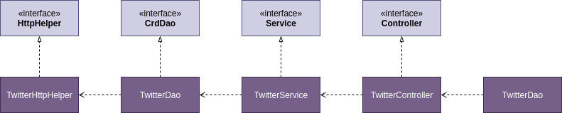

#TwitterCLI

## Introduction
The TwitterCLI application is an MVC (minus V) based application which helps users create, read 
and delete posts on Twitter using Twitter Rest API. The application has four versions - a regular 
one (TwitterCliApp), a Spring Framework's Bean approach based one (TwitterCLIBean), a Spring 
Framework's ComponentScan based one (TwitterCLIComponentScan) and a Spring boot based one 
(TwitterCLISpringboot). Building this application helped me to learn the basics of Rest APIs, Spring
 and Spring Boot. It also introduced me to the concepts of MVC architecture, Unit testing and 
 Integration testing using JUnit4 and Mockito framework. 
    
## Design
The class diagram of TwitterCLI application is shown below:



The different components of the TwitterCLI application are described below:
* TwitterHttpHelper - This class is an implementation of the HttpHelper interface and is responsible
 for sending and receiving HTTP POST/GET requests and responses respectively. 
* TwitterDao - This class is an implementation of the CrdDao interface and is responsible for
generating HTTP POST/GET URIs for creating/reading/deleting tweets. It passes the generated URIs to 
TwitterHttpHelper for executing the HTTP request and parses the HTTP response from TwitterHttpHelper
 into a Tweet object.
* TwitterService - This class is an implementation of the Service interface and is responsible for 
handling the business logic of the TwitterCLI application. When it is asked to post a tweet, it 
validates the length of the tweet and the range of the geo coordinates. When it is asked to 
show/delete a tweet, given the ID of the tweet, it validates the ID formats. Once the validation is 
complete, it asks TwitterDao to perform the corresponding action (create, read, delete).
* TwitterController - This class is an implementation of the Controller interface and is responsible
 for parsing the command line arguments passed by the user and calling the appropriate method of 
 TwitterService.
* TwitterCLIApp - This class is the entry point of the application (main class). It initializes all 
the components (dependencies) of the TwitterCLI application, parses the user input and calls 
appropriate method of TwitterController.     
    
## Quick Start
**Build package for TwitterCLI app**

1.Use the following commands to setup Twitter OAuth 1.0 authentication keys and secrets (consumer 
key, consumer secret, access token, token secret) as environment variables so they can be used by 
the TwitterCLI application to sign the HTTP requests made to Twitter REST API. Replace the "XXXXX"s 
with the respective values  of the Twitter Developer account.
```bash
export consumerKey=XXXXX
export consumerSecret=XXXXX
export accessToken=XXXXX
export tokenSecret=XXXXX
```
2.Use the following command to build the package while in the twitter/ directory:
``` bash
mvn package
```
**Run TwitterCLI Application**

1.Use the following command to run the TwitterCLI application to post/show/delete tweets:
```bash
java -jar target/java_apps-1.0-SNAPSHOT.jar post|show|delete [option(s)]
```
2.Structure of post, show and delete commands:
```bash
java -jar target/java_apps-1.0-SNAPSHOT.jar post <TweetTextToBePosted> <Longitude:Latitude>
java -jar target/java_apps-1.0-SNAPSHOT.jar show <TweetID>
java -jar target/java_apps-1.0-SNAPSHOT.jar delete <CommaSeparatedListOfTweetIDs> 
```

## Model
The Model of TwitterCLI application is implemented using five POJOs all of which help in representing a simplified version of 
Twitter's Tweet object:
1. Tweet
2. Coordinates
3. Entities
4. Hashtag
5. UserMention

Tweet objects are exchanged between Twitter REST API and the TwitterCLI application in JSON format. 
A sample JSON of the simplified Tweet object used in this application is shown below:
```json
{
   "created_at":"Mon Feb 18 21:24:39 +0000 2019",
   "id":1097607853932564480,
   "id_str":"1097607853932564480",
   "text":"test with loc223",
   "entities":{
      "hashtags":[],      
      "user_mentions":[]  
   },
   "coordinates":null,    
   "retweet_count":0,
   "favorite_count":0,
   "favorited":false,
   "retweeted":false
}
```
    
## Improvements
1. Include feature for editing (update) tweets.
2. Implement the original version of Tweet object, including media files and URLS.
3. GUI