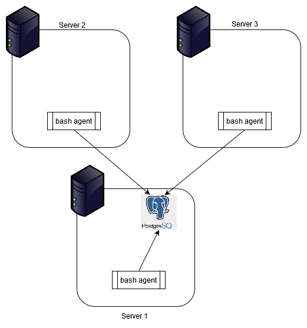

#Linux Cluster Monitoring Agent

## Introduction
The Cluster Monitoring Agent is a tool used to record hardware specifications and to monitor resource usage of all nodes in a cluster. One of the nodes in the cluster will have a PostgreSQL database which will store all these information from itself and the other nodes in the cluster with the help of the Agent installed in all the nodes. The hardware specification information will be collected only once while the resource usage information will be collected every minute. The Agent will also help the infrastructure team to generate meaningful reports which will be used for future resource planning.

## Architecture and Design
The diagram below shows a cluster of three nodes with the Cluster Monitoring Agent installed in them.


As shown in the diagram above, only one of the nodes contains the information of all other nodes.
The database consists of two tables:

**Table name | Updated | Description | Fields**
--- | --- | --- | ---
host_info | Once | Hardware specifications | ID, Hostname, CPU (number, architecture, model, clock speed), L2 cache size, Total memory, Timestamp of data collection
host_usage | Every minute | Resource usage | Timestamp of data collection, HostID, Free memory (in MB), CPU (idle time, kernel time), Number of disk I/O, Available disk

The Agent contains three bash scripts:
1. **psql_docker.sh** - This script creates and starts a new PostgreSQL instance in a Docker container if it doesn’t already exist. A volume is also assigned to it. It is run in the node which will contain the database.
2. **host_info.sh** - This script collects and stores the hardware specifications in the host_info table. It is run in all the nodes in the cluster.
3. **host_usage.sh** - This script collects and stores the resource usage information in the host_usage table. It is run in all the nodes in the cluster.

## Usage
1. Use the following command to start/stop a PostgreSQL instance in a Docker container (Server 1):
   ``` bash
   ./scripts/psql_docker.sh start|stop <password>
   ```
2. Connect to PostgreSQL instance and create database. This is done only once. (Server 1):
   ```bash
   psql -h localhost -U postgres
   ```
   Enter <password> when prompted.
   ```sql
   CREATE DATABASE host_agent;
   ```
3. Use the following command in all the nodes to collect and store hardware specifications:
   ```bash
   ./scripts/host_info.sh "<hostname of database server>" 5432 "host_agent" "postgres" "<password>"
   ```
4. Use crontab in all the nodes to schedule the execution of host_usage.sh every minute.
   Open crontab editor:
   ```bash
   crontab -e
   ```
   Enter the job of executing host_usage.sh:
   ```
   * * * * * bash ../linux_sql/scripts/host_usage.sh <hostname of database server> 5432 host_agent postgres password > /tmp/host_usage.log
   ```

## Improvements
1. Create a backup for the database
2. Automatic updates for change in hardware specifications
3. GUI

