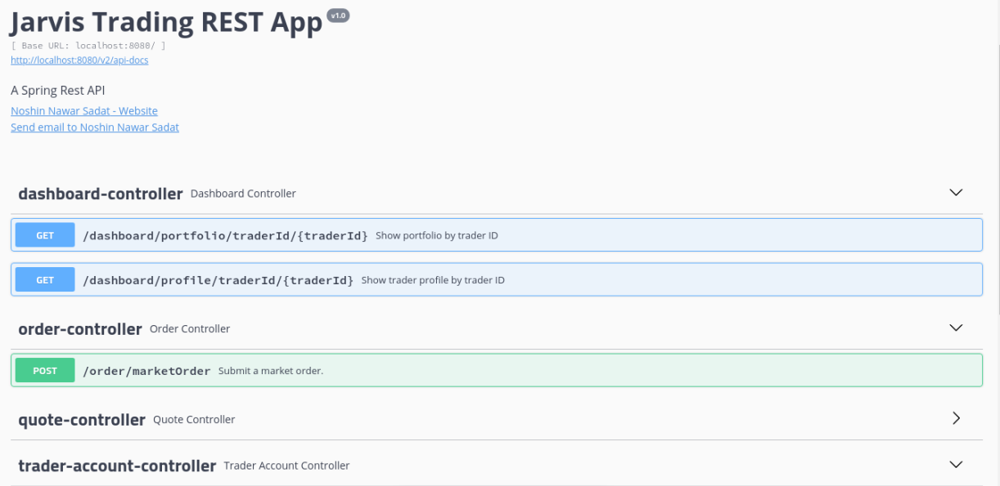
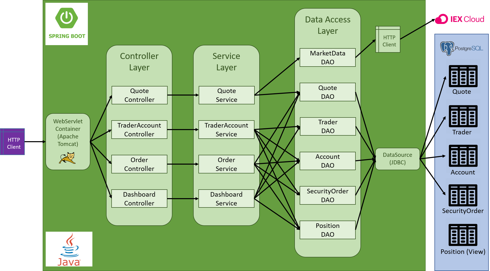
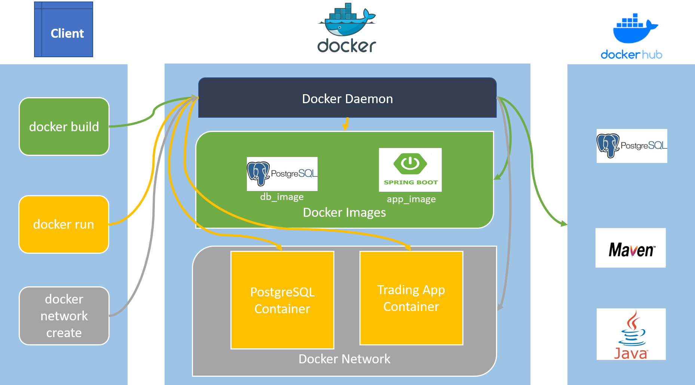

# Jarvis Trading REST App

Table of contents
* [Introduction](#Introduction)
* [Quick Start](#Quick-Start)
* [Architecture](#Architecture)
* [REST API USAGE](#REST-API-Usage)
* [Docker Deployment](#Docker-Deployment)
* [Improvements](#Improvements)

## Introduction
The Jarvis Trading REST app is a Java8 and Springboot based REST API of a trading platform which 
allows users (developers, traders etc.) to view, create and manage traders, accounts, quotes and 
security orders. It uses IEX Cloud as a data source and PostgreSQL to persist data. A three-tier 
microservice MVC architecture is used to implement it. Spring DAO is used to handle data access in 
the PostgreSQL database. Docker images of the database and application are built for easy deployment.

## Quick Start
### Prerequisites:
Docker, CentOS 7

### Running the application

1. Check Docker version. It must be 17.05 or higher.
    ```bash
   #start docker
   sudo systemctl start docker
   #check version
   sudo docker -v
    ```
2. Build docker images for the database and the trading application.
    ```bash
   #build docker image for database
   cd ./springboot/psql
   sudo docker build -t <db_image_name> .
   #build docker image for the trading application
   cd ./springboot
   sudo docker build -t <app_image_name> .
    ```
3. Create a Docker network to attach the docker containers of the images to. Skip if it already exists.
    ```bash
   #create network
   sudo docker network create <network_name>
   #verify network creation
   sudo docker network ls
    ```  
4. [Optional] If the data needs to be retained even after application is stopped, create a docker 
volume.
    ```bash
   sudo docker volume create <volume_name>
    ```
5. Run the Docker containers from the built images.
    ```bash
   #container for the database (remove the -v option if data retention is not necessary (refer to step 4))
   sudo docker run --name <db_container_name> \
   -e POSTGRES_PASSWORD=<db_password> \
   -e POSTGRES_DB=<db_name> \
   -e POSTGRES_USER=<db_username> \
   --network <network_name> \
   -v <volume_name>:/var/lib/postgresql/data \
   -d -p 5432:5432 <db_image_name>
   
   #container for the application
   IEX_PUB_TOKEN="<IEX_account_token>"
   sudo docker run --name <app_container_name>\
   -e "PSQL_URL=jdbc:postgresql://<db_container_name>:5432/<db_name>" \
   -e "PSQL_USER=<db_username>" \
   -e "PSQL_PASSWORD=<db_password>" \
   -e "IEX_PUB_TOKEN=${IEX_PUB_TOKEN}" \
   --network <newtwork_name> \
   -p 8080:8080 -t <app_image_name>
   
   #verify running containers
   sudo docker ps
    ``` 
 6. Start and stop containers
    ```bash
    sudo docker container start|stop <container_name>
    ```
7. Stop docker
    ```bash
   sudo systemctl stop docker
    ```

### Try the trading application with SwaggerUI

After running/starting both the containers, visit the following link in the preferred internet browser:
```html
http://localhost:8080/swagger-ui.html#
```
The following page will be shown:



Explore the endpoints in SwaggerUI to get familiar with the REST API.

## Architecture
### The components of the Jarvis Trading REST App



**Controller Layer:** This layer parses the HTTP requests made by the HTTP clients (e.g. chrome, 
postman, curl etc.) and calls the appropriate methods in the corresponding Service classes of the 
Service layer.

**Service Layer:** This layer handles the business logic of the application. It verifies if the user
 inputs (e.g. ticker name, trader ID) are correct or not, and calls appropriate methods of the DAO 
 classes from the Data Access layer.
 
**Data Access Layer:** This layer consists of DAO classes which are mainly responsible for data
access in the Postgres database through the DataSource API and in the Iex Cloud through HTTP requests.

**SpringBoot:** The SpringBoot framework's IoC is used to manage the components of the application 
and run it. Spring DAO is utilized to handle data access with JDBC more easily and Springboot's 
default implementation of Java WebServlet (Apache TomCat) is used to listen for HTTP requests from 
the HTTP client.  

**PostgreSQL and IEX:** PostgreSQL is used to persist the data of the the application (trader, 
account, security order, quote and position), while IEX Cloud is used to gather quotes of tickers.

## REST API Usage
### Swagger
Swagger is an open-source software framework that helps developers design, build, document, and 
consume RESTful web services.  Swagger allows one to describe the structure of their APIs so that it
 can automatically build beautiful and interactive API documentation for the API. It can also 
 automatically generate client libraries for the API in many languages and explore other 
 possibilities like automated testing. It is mainly used for creating interactive documentations for 
 RESTful APIs. 

### Quote Controller
Quote Controller is responsible for gathering quotes from IEX Cloud and caching them in the 
PostgreSQL database. Its endpoints are briefly described below:
- GET `/quote/dailyList`: Lists all securities that are available for trading in this trading 
platform.
- GET `/quote/iex/ticker/{ticker}`: Retrieves and shows current quote of given ticker from IEX Cloud. 
- POST `/quote/tickerId/{tickerId}`: Saves current quote of given ticker in the quote table of 
PostgreSQL database.
- PUT `/quote/`: Updates a quote in the quote table using a provided quote.
- PUT `/quote/iexMarketData`: Updates all the quotes in the quote table using data from IEX Cloud.
### TraderAccount Controller
TraderAccount Controller is responsible for managing the trader and account information. It also 
handles the depositing and withdrawal of funds from a given account. Its endpoints are briefly 
described below: 
- DELETE `/trader/traderId/{traderId}`: Deletes a trader's information (trader table) and their 
account (account table), when their ID is provided.
- POST `/trader/`: Creates a trader in the trader table and an associated account with 0 balance in 
the account table, when trader information is provided via a DTO.
- POST `/trader/firstname/{firstname}/lastname/{lastname}/dob/{dob}/country/{country}/email/{email}`:
Creates a trader in the trader table and an associated account with 0 balance in the account table, 
when trader information is provided via the URL.
- PUT `/trader/deposit/traderId/{traderId}/amount/{fund}`: Manages depositing (adds to account 
balance) of a fund, when the fund and the account ID are provided.
- PUT `/trader/withdraw/traderId/{traderId}/amount/{fund}`: Manages withdrawal (subtracts from 
account balance) of a fund, when the fund and the account ID are provided.
### Order Controller
Order Controller is responsible for handling market buy/sell orders and updating the security order 
table. Its endpoints are briefly described below: 
- POST `/order/marketOrder`: Depending on the provided size, ticker and account ID, it submits a 
market buy or sell order. 
### Dashboard Controller
Dashboard Controller is responsible for listing all the information associated with a trader. Its 
endpoints are briefly described below: 
- GET `/dashboard/portfolio/traderId/{traderId}`: Shows portfolio (security rows) of a trader, when 
their ID is provided.
- GET `/dashboard/profile/traderId/{traderId}`: Shows the trader's information and their account 
information, when their ID is provided.

## Docker Deployment


The Jarvis Trading REST App can be dockerized for fast and easy deployment. For this purpose, two 
Dockerfiles have been created - one for building docker image of the trading application and the 
other for that of the underlying PostgreSQL database.

- **db_image:** To build the database image, first the base image `postgres:9.6-alpine` is pulled 
from Docker hub. This base image comes with an initialization script which runs all the .sql and .sh
 files in the /docker-entrypoint-initdb.d directory when the image is built. The .sql file of the 
 trading app which contains the database and table definitions are copied to this directory so they 
 can be initialized when the container for the database is created. 
- **app_image:** To build the application image, the base images maven:3.6-jdk-8-slim and 
openjdk:8-alpine are pulled from Docker hub. By using the maven:3.6-jdk-8-slim image, the source code
is built and packaged and by using the openjdk:8-alpine image, the application starts running when 
the container for the application is created.
 
## Improvements
- Collect quote data in real time
- Handle limit orders
- Implement concurrent programming to efficiently handle multiple requests at a time
- Persist historical data and include price prediction functionality
- UI
